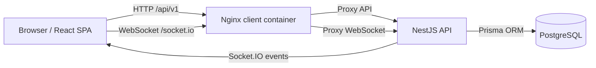
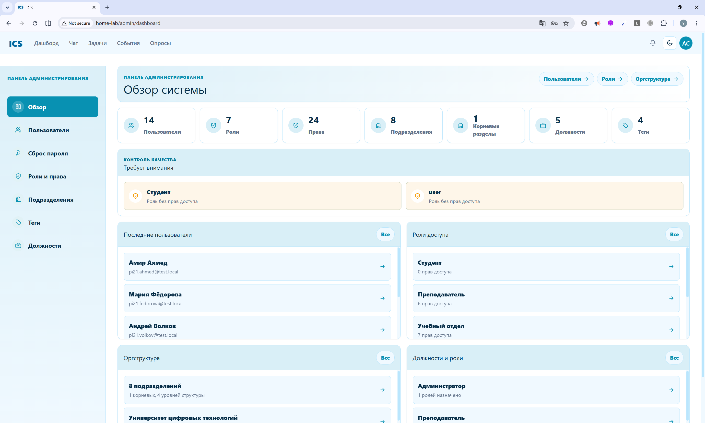
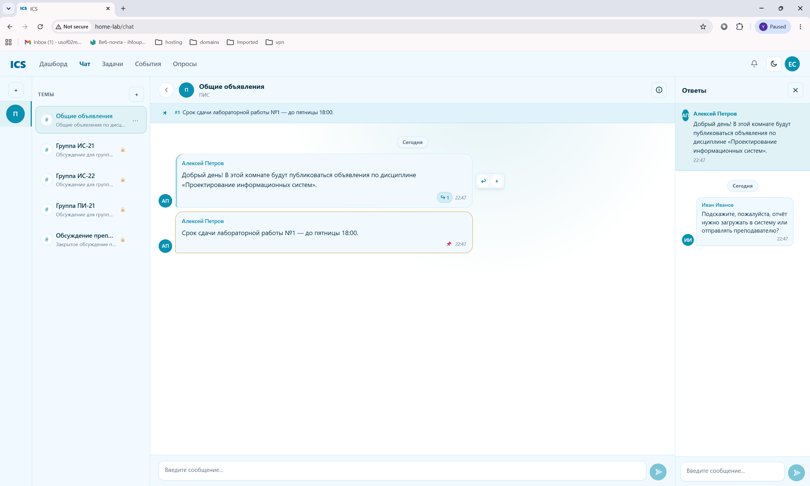
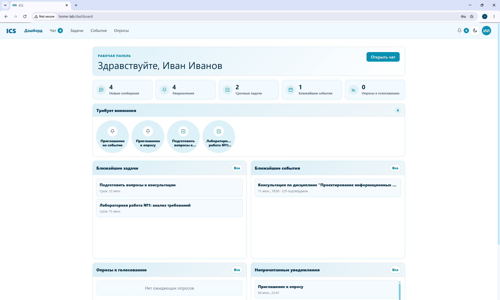
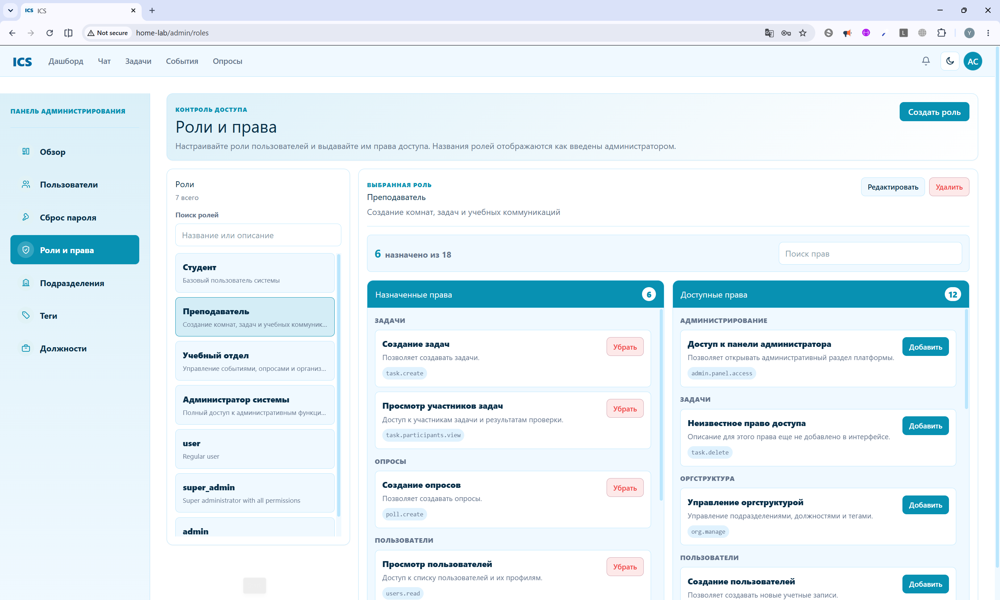

# University CRM & Communication Platform

**Bachelor's graduation project** — a university-focused CRM and internal communication platform for collaboration, administration, and academic workflow coordination.

**Stack:** NestJS · TypeScript · Node.js · PostgreSQL · Prisma · React · Socket.IO · Docker · Nginx

This project combines a React client with a modular NestJS backend to support university communication and collaboration workflows: real-time room/topic messaging, tasks, events, polls, notifications, user administration, role-based access control, relational data modeling, and Docker-based deployment behind Nginx.

## Main Features

- Real-time chat with rooms, topics, pinned messages, replies, threads, and room roles.
- Tasks with participants, status tracking, review flow, deadlines, and late submission handling.
- Events with invitations, participant confirmation, and upcoming/past grouping.
- Polls with voting, results, configurable vote changes, and participant management.
- Notifications, including real-time administrative password reset and registration request alerts.
- User dashboard focused on current work and pending actions.
- Admin panel for users, roles, permissions, password reset requests, organization units, tags, positions, and admin overview.
- Local password reset and registration approval flows managed by administrators.

## Backend Highlights

Verified from the NestJS source, Prisma schema, and Docker setup:

- Modular NestJS architecture organized by domain modules: `auth`, `users`, `rbac`, `rooms`, `topics`, `messages`, `tasks`, `events`, `polls`, `notifications`, and `org-units`.
- REST API exposed under the `/api/v1` global prefix and separated into feature controllers/services.
- PostgreSQL persistence through Prisma ORM, with database migrations stored in `server/prisma/migrations`.
- Relational data model with indexes, composite IDs, unique constraints, many-to-many relations, soft-delete fields, and workflow enums for tasks, registration requests, password reset requests, polls, and notifications.
- JWT access-token authentication using Passport JWT guards.
- Refresh-token session management with hashed refresh tokens, expiry tracking, rotation on refresh, and revocation on logout, password change, account deactivation/blocking, and soft delete.
- Authentication and authorization are separated: authentication is handled in `auth`, while global and room-level authorization are handled in `rbac` guards/decorators.
- Role-Based Access Control (RBAC) for global permissions and room-level roles/permissions.
- Socket.IO gateway for authenticated real-time updates and per-user/per-room event delivery.
- Account activation, deactivation, blocking, unblocking, and soft deletion flows.
- Administrator-approved registration and password reset workflows.
- DTO validation via NestJS global `ValidationPipe` with `whitelist` and `transform` enabled.

## Architecture



- **Frontend:** React + TypeScript + Vite, using Redux Toolkit/RTK Query for API state and Socket.IO client for real-time events.
- **Backend:** NestJS + TypeScript + Prisma, organized into domain modules and exposed through REST controllers.
- **Database:** PostgreSQL, modeled through Prisma schema and migrations.
- **Real-time:** Socket.IO authenticates connections with the JWT access token and emits updates to user-specific and room-specific channels.
- **Deployment:** Docker Compose runs `db`, `api`, and `client`; Nginx serves the SPA and proxies `/api/v1` plus `/socket.io` to the API container.

## Security

Verified security mechanisms in the repository:

- Passwords are hashed with `bcrypt` before storage.
- Access tokens are signed JWTs and are sent by the frontend as Bearer tokens.
- Refresh tokens are stored as HTTP-only cookies by the auth controller.
- Refresh sessions store bcrypt hashes of refresh tokens instead of plaintext tokens.
- Refresh tokens are rotated on refresh and revoked on logout; user session revocation also happens on password change, deactivation, blocking, and soft deletion.
- Active/blocked/deleted account checks are performed during login, token refresh, directory search, and user management flows.
- Global RBAC permissions protect administrative APIs, and room-level permissions protect chat room/topic management operations.
- CORS is configured from environment variables and allows credentials for API requests.
- Global DTO validation uses `ValidationPipe({ whitelist: true, transform: true })`.
- Secrets and deployment values are environment-based, with placeholder examples in `.env.example` and `server/.env.production.example`.

Not claimed: OAuth, MFA, rate limiting, CSRF protection, Helmet, encryption at rest, or secret rotation.

## Screenshots

Existing application screenshots are available in `images/`. Selected recruiter-facing screens:

| Admin dashboard | Chat room with message thread |
| --- | --- |
|  |  |

| Student dashboard | RBAC management |
| --- | --- |
|  |  |

Additional available screenshots include login, tasks, events, polls, notifications, profile, organization management, users management, room information, and password reset request screens.

## Project Structure

```text
.
├── client/             # React + TypeScript + Vite frontend application
├── server/             # NestJS backend API, Prisma integration, and Socket.IO gateway
├── server/src/auth     # Login, registration approval, refresh sessions, password reset, password changes
├── server/src/rbac     # Global RBAC and room-level authorization decorators, guards, controllers, services
├── server/src/messages # Chat messages, replies, read/receive tracking, and pinning
├── server/src/tasks    # Task creation, participants, work status, review status, deadlines, ratings
├── server/src/events   # Event creation, participants, confirmation, and event lists
├── server/src/polls    # Polls, options, voting, results, and poll participants
├── server/prisma       # Prisma schema, migrations, and seed scripts
├── docker-compose.yml  # Docker Compose stack for PostgreSQL, API, and Nginx-served client
├── deployment.md       # Detailed Docker/VPS deployment notes
└── ER.svg              # Entity-relationship diagram for the database model
```

## Local Development

Install dependencies separately:

```bash
cd server
npm install

cd ../client
npm install
```

Configure local environment files as needed:

```bash
cp server/.env.production.example server/.env
cp client/.env.production.example client/.env
```

For normal local development, use local URLs in those files rather than production domain values.

Start the backend:

```bash
cd server
npm run start:dev
```

Start the frontend:

```bash
cd client
npm run dev
```

Build both applications:

```bash
cd server
npm run build

cd ../client
npm run build
```

## Testing

Automated tests are not included in the current repository snapshot. The backend package still contains Jest tooling inherited from the NestJS setup, but this README does not claim test coverage until meaningful tests are added.

## Docker Deployment

The project includes a Docker Compose setup documented in [deployment.md](./deployment.md):

- `db`: PostgreSQL 16 Alpine with a persistent `postgres_data` volume.
- `api`: NestJS API; runs `npx prisma migrate deploy` before `npm run start:prod`.
- `client`: Nginx serving the React build and proxying `/api/v1` and `/socket.io`.

Create environment files:

```bash
cp .env.example .env
cp server/.env.production.example server/.env.production
```

Build and start:

```bash
docker compose build
docker compose up -d
```

Run seed manually only when needed:

```bash
docker compose exec api npx prisma db seed
```

Full deployment instructions are documented in [deployment.md](./deployment.md).

## Useful Commands

```bash
# Backend build
cd server && npm run build

# Frontend build
cd client && npm run build

# Docker Compose configuration check
docker compose config

# Docker logs
docker compose logs -f api
docker compose logs -f client
docker compose logs -f db

# Run production migrations
docker compose exec api npx prisma migrate deploy
```

## Project Notes

- I developed this project as my Bachelor's graduation project.
- The README describes only functionality and technologies that are present in this repository.
- Swagger/OpenAPI is not listed in the stack because it is not configured in the current codebase.
- The deployment approach follows the existing Docker Compose + Nginx setup included with the project.
